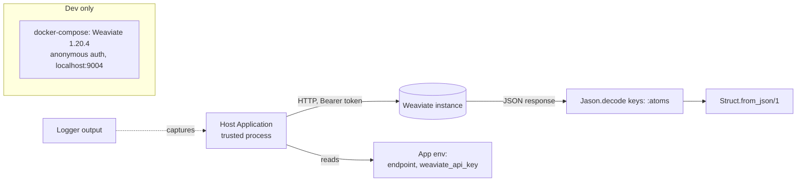

# Threat Model

## Overview

`noizu_weaviate` is a **client library**, not a service: it has no inbound surface (no routes, no listeners beyond the Finch pool it supervises inside the host application). The assets are the **Weaviate API credential** (`weaviate_api_key`) and the **vector data in transit** between the host application and the Weaviate endpoint. The single trust boundary that matters is host process → Weaviate instance; the model below therefore concentrates on egress transport, credential handling, and parsing of responses that cross that boundary. Deployment perimeter (ingress/TLS to Weaviate) is owned by the consuming application, not this library.

## Attack Surface

Grounding: components and data flow per [PROJ-ARCH.md](PROJ-ARCH.md); dispatch code in `lib/noizu_weaviate.ex` (`api_call/5`, `headers/0`).

## Vulnerability Register

| ID | Severity | STRIDE | Component | Status |
|----|----------|--------|-----------|--------|
| T-001 | High | Spoofing / Info disclosure | Default endpoint `http://api.weaviate.com/` is plain HTTP — credential and vector data in cleartext if consumer does not override | Open (documented; consumer must set HTTPS `endpoint`) |
| T-002 | Medium | DoS | `Jason.decode(body, keys: :atoms)` in `api_call/5` and streaming path creates atoms from response keys — atom-table exhaustion if the endpoint is hostile/MITM'd | Open (accepted: endpoint is trusted infra; would require `keys: :atoms_existing` + struct-key prelude to fix) |
| T-003 | Low | Info disclosure | `Logger.warn("API ERROR: #{inspect(error)}")` can write full response/request bodies (incl. bearer header via Finch request inspect in callbacks) into host logs | Open (accepted: aids debugging; consumers should scrub logs) |
| T-004 | Low | DoS | Fixed 600 s pool/receive/request timeouts hold Finch pool members on slow endpoints | Open (accepted: batch/import workloads need long timeouts) |
| T-005 | Info | — | `docker-compose.yml` runs Weaviate 1.20.4 with `AUTHENTICATION_ANONYMOUS_ACCESS_ENABLED: 'true'` | Mitigated by scope (dev-only, bound port; never deploy this compose as-is) |

Not applicable: Tampering/Repudiation/Elevation at an inbound edge (no inbound edge), secrets stores (library stores none — credential lives in consumer's app env), supply chain beyond Hex pins in `mix.lock`.

## Mitigation Coverage

0 mitigated in code · 2 accepted-with-rationale (T-002, T-003, T-004) · 1 consumer-action-required (T-001) · 1 scoped-out (T-005).

## Residual Risk

The library assumes the configured Weaviate endpoint is trusted and reached over a transport the consumer secures. The largest real exposure is T-001: any consumer that relies on the compile-time default ships its API key over cleartext HTTP. Second-order: response-key atomization (T-002) turns a compromised endpoint into a host-DoS vector.
